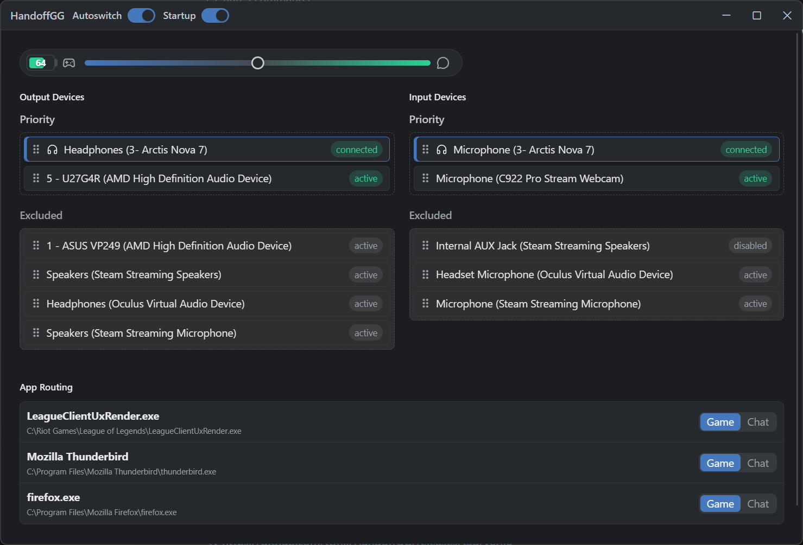
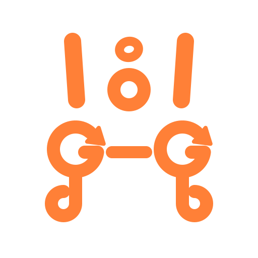

# HandoffGG




HandoffGG is a small tray app for automatically switching audio devices when a SteelSeries wireless headset is actually connected or disconnected. It runs on **Windows** (Core Audio) and **Linux** (Wayland/X11 with PipeWire).

This was almost entirely vibecoded, with some manual cleanup here and there.

## What It Does

- Allows you to set a priority list of audio devices for output/input. When your SteelSeries headset disconnects, it moves down the list to the next available device, same thing happens if a device is unplugged. When the headset reconnects, it moves back up to the headset devices.
- Allows you to use the headset's chatmix wheel to adjust the volume of apps configured as "chat" and "game". Apps are assigned to chat automatically via OS audio sessions (Windows audio sessions / PipeWire output streams), but you can also set them manually.
- DOESN'T KEEP RESETTING YOUR DEVICE PREFERENCES. 
- DOESN'T RANDOMLY STOP OPENING.
- 6MB memory usage when in the tray.
- Sends a desktop notification when the headset battery runs low (threshold
  configurable in settings, works without a tray).
- Mirrors the live headset state to a small JSON file for scripts and status
  bars (see [Status file](#status-file)).

## Limitations
This was developed against a SteelSeries Arctis Nova 7 on Windows 11. The Linux backend (PipeWire) was written and tested without the headset on hand — the HID layer is shared with Windows and validated by replaying captured USB report frames through the decision pipeline (see `src-tauri/src/pipeline_tests.rs`), but real-hardware confirmation on Linux is still welcome. Very likely not to work with most other models; if there is interest in supporting more, PRs are welcome.

## Installation

### Windows

Installers (MSI) are published from GitHub Releases:

https://github.com/ttmx/HandoffGG/releases

### Linux

Two options:

- **AppImage** — download the `.AppImage` from the same Releases page, `chmod +x` it, and run.
- **Arch (AUR)** — install the `handoffgg` package (PKGBUILD under [`packaging/aur`](packaging/aur)).

Linux needs PipeWire (with WirePlumber) running, which is the default on current desktop
distros. Presence detection reads the headset over `hidraw`, which is root-only by default,
so install the udev rule that ships in [`packaging/72-steelseries-handoffgg.rules`](packaging/72-steelseries-handoffgg.rules)
(the AUR package installs it for you):

```bash
sudo cp packaging/72-steelseries-handoffgg.rules /etc/udev/rules.d/
sudo udevadm control --reload-rules && sudo udevadm trigger --action=add
```

(The `72-` prefix matters: the rule has to sort before systemd's `73-seat-late.rules`,
which is what actually applies the access ACL. A higher number tags the device but never
grants access. No logout needed — the trigger above re-applies the rule to the plugged-in
headset.)

#### Desktop integration / how to open and quit it

HandoffGG lives in the background. How you reach it depends on the desktop:

- **KDE, XFCE, GNOME with the [AppIndicator extension](https://extensions.gnome.org/extension/615/appindicator-support/)** — it shows a **system tray icon**: left-click opens settings, right-click for the menu.
- **GNOME (default, no tray)** — there is no tray icon. Instead:
  - **Open settings**: click the HandoffGG icon in the app grid. (It runs as a single
    instance, so this focuses the existing window or opens a new one — it never starts a
    second copy.)
  - **Quit**: right-click the app-grid icon → **Quit**, or use **Quick Settings →
    Background Apps**, where HandoffGG registers itself via the desktop portal. From a
    terminal, `handoffgg --quit` also works.
- **Autostart** (any desktop): enable it from the settings window. The login-time launch
  passes `--hidden` so it starts quietly in the background instead of popping the window.

## Status file

On every headset state change, HandoffGG writes the current status as JSON to:

- **Linux**: `$XDG_RUNTIME_DIR/handoffgg/status.json`
- **Windows**: `%TEMP%\handoffgg\status.json`

```json
{
  "connected": true,
  "batteryPercent": 68,
  "micMuted": false,
  "gameVolume": 100,
  "chatVolume": 100,
  "error": null,
  "observedAtMs": 1765500000000
}
```

Writes are atomic, so it is always a complete document. This makes battery/mute
trivially scriptable on desktops without a tray — e.g. a waybar custom module:

```jsonc
"custom/headset": {
  "exec": "jq -r 'if .connected then \"\\(.batteryPercent)%\" else \"off\" end' $XDG_RUNTIME_DIR/handoffgg/status.json",
  "interval": 30
}
```

The file is only as fresh as the last event (check `observedAtMs` if you need to
detect a stale file after a crash).

## Development

This project uses:

- Tauri 2 for the desktop shell and tray integration
- Rust for the native behaviour: HID presence (cross-platform via `hidapi`), Windows Core
  Audio (`windows_audio.rs`) and Linux PipeWire (`pipewire_audio.rs`) behind a shared
  `AudioBackend` trait
- SvelteKit, Svelte 5, TypeScript, Vite, and Tailwind CSS for the UI

On Linux, install the build dependencies first (Arch shown; on Debian/Ubuntu use the
`-dev` packages from the [CI workflow](.github/workflows/build-installers.yml)):

```bash
sudo pacman -S --needed webkit2gtk-4.1 gtk3 libayatana-appindicator pipewire clang pkgconf nodejs npm
```

Install dependencies and run in development:

```bash
npm ci
npm run tauri -- dev
```

Run checks:

```bash
npm run check
npm run lint
cd src-tauri
cargo check --locked
cargo test --locked
```

Build locally:

```bash
npm run tauri -- build
```

On Arch (and other distros with very recent binutils), the AppImage step needs two env
vars — `NO_STRIP=1` because linuxdeploy's bundled `strip` can't parse modern `.relr.dyn`
sections, and `APPIMAGE_EXTRACT_AND_RUN=1` if AppImage FUSE-mounting is unavailable:

```bash
NO_STRIP=1 APPIMAGE_EXTRACT_AND_RUN=1 npm run tauri -- build
```

Bundle output (MSI on Windows, AppImage on Linux) is written under:

```text
src-tauri/target/release/bundle/
```
<p align="center">
  
</p>

The icon is supposed to look like an H (from Handoff), two Gs with arrows, speaker drivers on the top, and headphones on the bottom, symbolizing the switching of audio devices. Also looks like a little face which is cool. An actual logo would be welcome, since this looks bad on the tiny tray and taskbar.